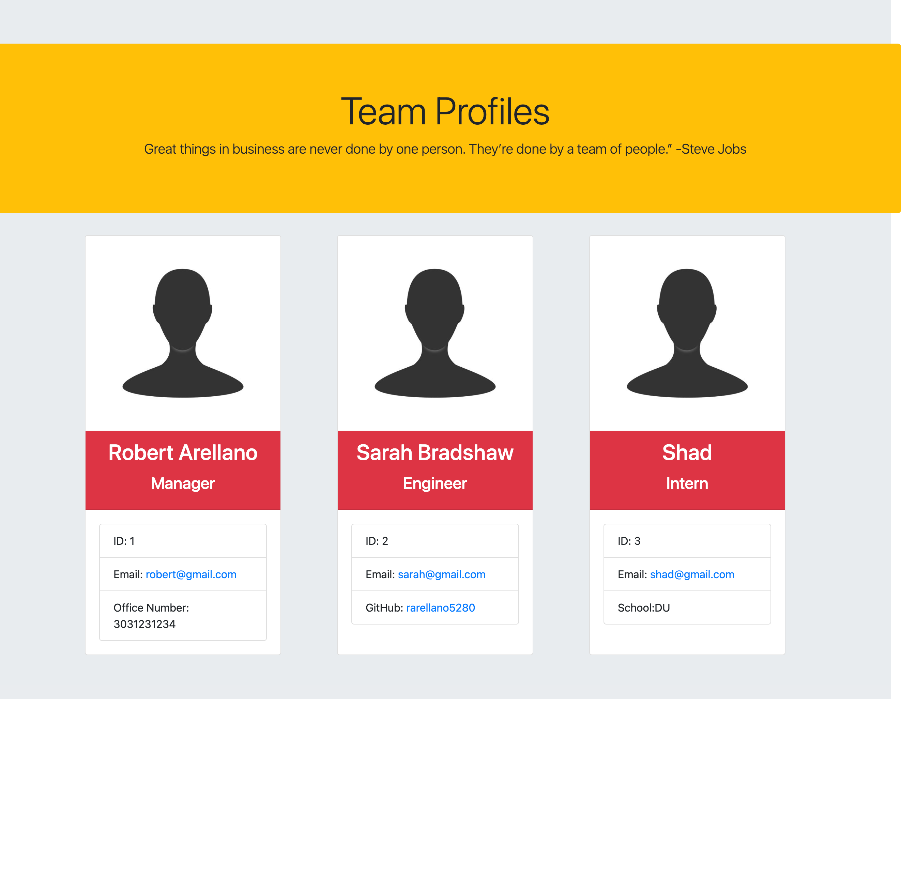

# Team Profile Generator
  
  

## Table Of Contents
1. [Description](#description)
2. [Installation](#installation)
3. [Usage](#usage)
4. [Screenshot](#Screenshot)
5. [Demo Video](#demo-video)
6. [Test](#test)
7. [License](#license)
8. [Contact Me](#contact-me)
    
  ## Description
   This app uses node.js to render a polished front end HTML file. The data within this file has been rendered from the command line using node.js. I was able to utilize classes and constructors to create objects for specific members of the team. This data is then dynamically injected witin a html template that ultimately gets rendered as a webpage. 

  ## Installation
To install this project you will need to following things installed on your local computer:
* VS CODE
* Node.js

You will can install the NPM node package manager by running the following command in the command line "npm init" if you'd like to autocomplete the questions that are asked you can run "npm init -y" instead. 

  ## Usage
  To use my app. You will first need to ensure that you have Node.js installed on your local computer. Once you have it installed you can run the command "node index.js". This will bring up prompts that will ask you questions about the team members you'd like to add to your team profile. Once you're finished adding team members you can choose "Team is complete" from the choices prompt and it will complete your team profile. You will notice that my app will create a index.html with all your answers. Each team meber will have thier own card with all entered details neatly organized. 

  ## Screenshot
  

  ## Demo Video
  https://bootcampspot.instructuremedia.com/embed/93800fdb-b9fa-41bb-b979-305697cbc46e

  ## Test
  Testing is currently not working, but eventually you will be able to install jest and you can run the following command "npm run test" to test my app to ensure it passes all tests.

  ## License
  The project is protected under the MIT license. Please follow the following link if you'd like more details about this license https://choosealicense.com/licenses/mit/

  ## Contact Me
  GitHub: https://github.com/rarellano5280

  Email: robertarellano26@yahoo.com

